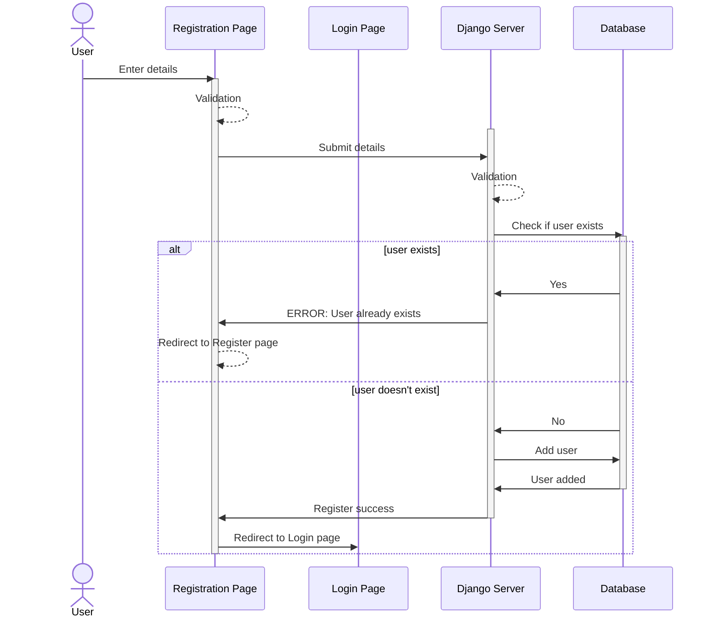
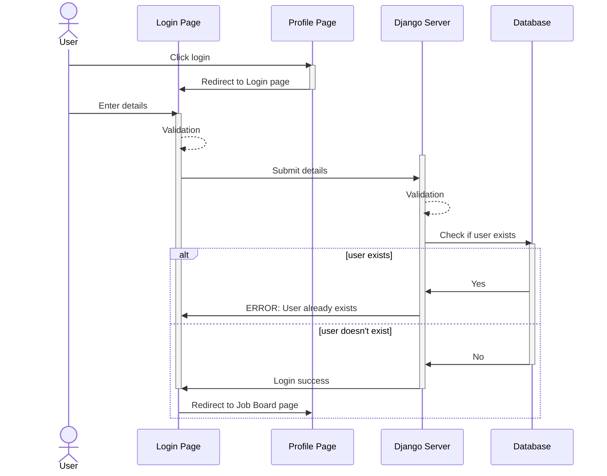
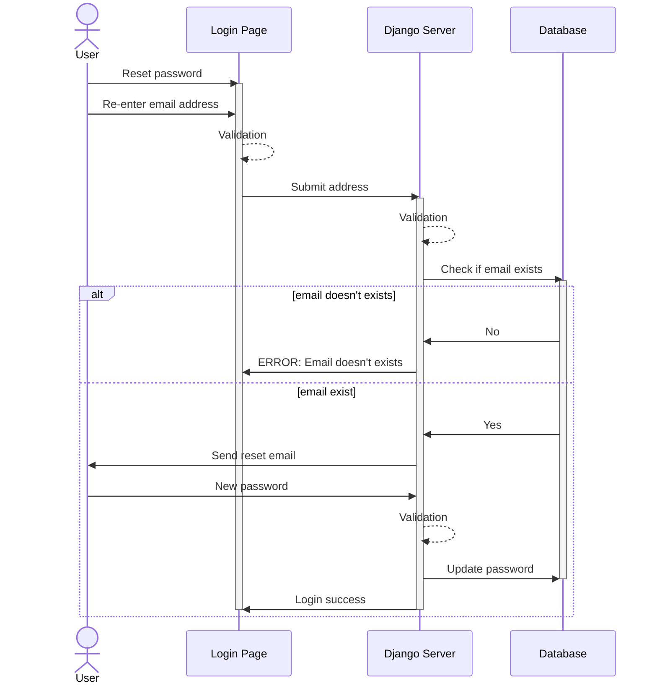
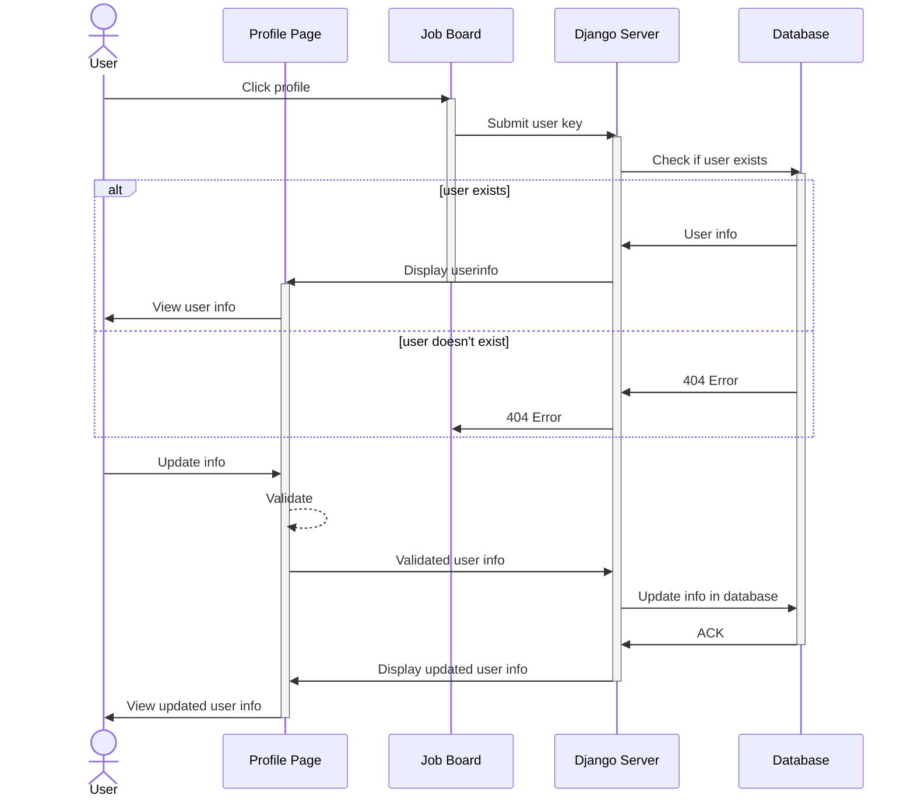
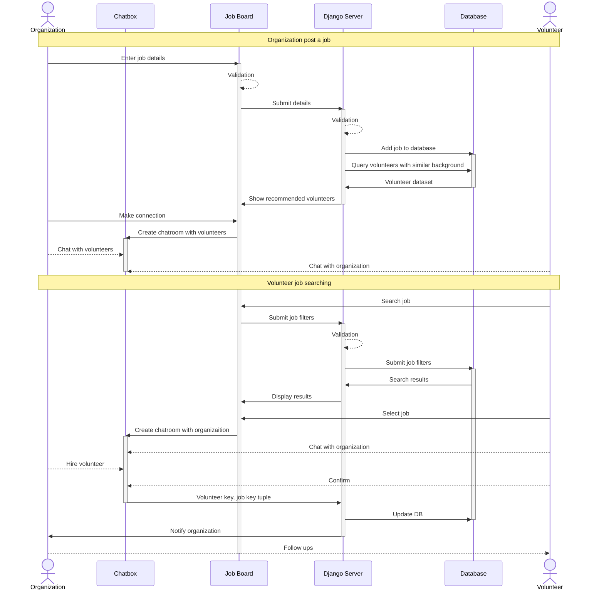

# VolunCHEER

:link: https://github.com/gcivil-nyu-org/INET-Monday-Spring2023-Team-2

## What is VolunCHEER?
VolunCHEER is an application with advanced professional job board features like LinkedIn and Glassdoor yet built explicitly for NYC Volunteers. VolunCHEER would provide a way for organizations and volunteers to connect, communicate, as well as highlight their accomplishments all on one platform.

***

## Build and Test Status

### Main

### Develop

## Wiki

# High-Level Context Diagram

# Sequence Diagram

## Register

## Login

## Reset Password

## Profile Page

## Job Board

# Deployment Diagram

